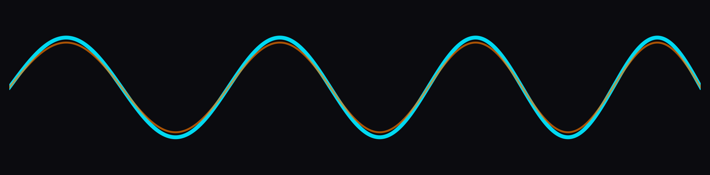

  

    
  

  <h1 style="color:#00FFFF;">Enrique / perazaharmonics</h1>
  <h3 style="color:#C77DFF;">RF • Digital Signal Processing • SDR • Real-time Systems • Kubernetes</h3>

  
<em>I just really like signals. Computers make waveforms go zoom. So I program those too.</em>

  

    
    
    
    
    
    
  

---

### About
- **DSP/RF engineer** building tools to process data with **nice shapes** on C++, mostly 
- Works on **telemetry ground systems** (AOS, commutators, packet processors) and **SDR** pipelines.
- Packages everything inside **containers**, orchestrated via **Kubernetes**, hardened for production.
- Hardcore punk, man. Drumming, mathematical proofs, and **gorgeous signals**.

---

### Current Work
- **FCWTransforms** — FFTs (Split-Radix, PFA, Bluestein, Rader, Stockham's, etc), MUSIC, PCA, Spectral Windows; Cosine Transforms.
- **Adaptive Wavelet Synthesizer (AWSynth)** — live wavelet synthesis for timbre morphing.
- **The Projectionist** - 4D Noise Field Projector unto a waveshapen LFO. Audio Scaping Engine.
- **Waveguide Modeling** — physical strings, bodies, FDN reverbs, 2D/3D meshes; fractional delays (Thiran→Farrow).
- **Aerospace SDR Stack** — VITA-49/DIFI transport, modular telemetry pipelines, HA/persistence.
- **K8s Infrastructure** — Cilium networking, Helm-managed services, persistent metrics endpoints.

---
### Visual Gallery — RF / DSP

  <!-- Row 1: QPSK + FFT -->
  

    
    
  

  <!-- Row 2: CWT + Ambiguity -->
  

    
    
  

---

### Projectionist — 4D Noise Fields

  
  
  

  
  
  

  
  

  Generated via Python simulation of <code>Shape4D()</code> dispatcher for C++ Projectionist Synth.

---

### Selected Projects
- **[FCWTransforms](https://github.com/perazaharmonics/FCWTransforms)** — transforms toolkit: FFTs, DCTs, wavelets.
- **[Time Frequency Analysis](https://github.com/perazaharmonics/Time-and-Frequency-py)** — Multi Resolution Analysis.
- **[Digital Image Processing](https://github.com/perazaharmonics/Image-Processing-Matrices)** — 2D Spectral analysis kernels.
- **[Wavelet Projectionist Synth (WAVEPRO)]** — Wavelet atom injector of the waveform into itself.
- **[Speech Processing](https://github.com/perazaharmonics/SpeechProc/tree/main)** - Speech Information extraction through spectral methods.
- **[SATMAT](https://github.com/perazaharmonics/SATMAT)** — Radio Frequency Ground Station and Satellite Calculations.

---

### Toolchain
- **Languages**: C++, C, Go, Python, MATLAB, LabVIEW, JAVA, Bash  
- **DSP**: FFTs, STFT/WOLA, Wavelets, MUSIC/ESPRIT, Pattern Recognition  
- **RF/SDR**: VITA-49, framing, constellations, SNR/EB/N₀, Ambiguity Surface Resolution, Phased Arrays  
- **Infrastructure**: Kubernetes, Helm, Ansible, Cilium, containerd, Prometheus  
- **Build/Test**: CMake, Make, Catch2, GitHub Actions  
- **OS**: RHEL 8/9, FedoraLinux, AlmaLimux, Windows

---

  

### Philosophy
> Build it. Break it. Learn from it.  
> Precision, noise; punk rock.

---

  
  

Built for RF, DSP, and clean systems.

