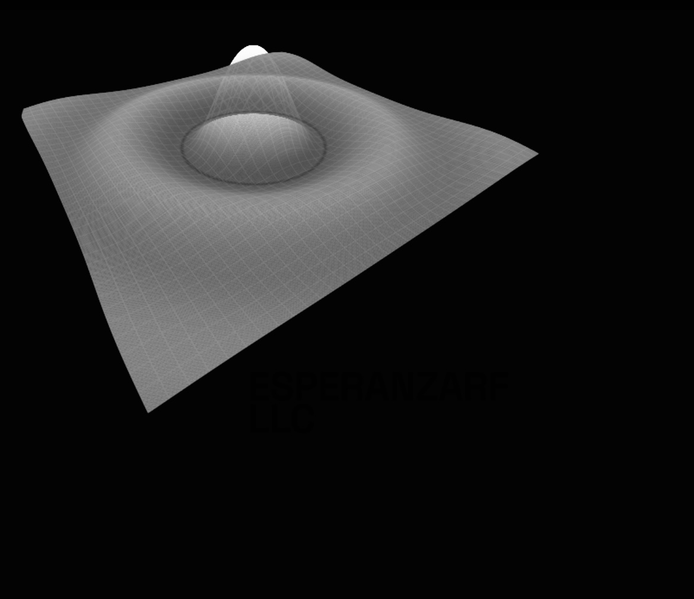

  

    
  

  <h1 style="color:#00FFFF;">Enrique / perazaharmonics</h1>
  <h3 style="color:#C77DFF;">RF • Digital Signal Processing • SDR • Real-time Systems • Software Development </h3>

  
<em>I just really like signals. Computers make waveforms go zoom. So I program those too.</em>

  

    
    
    
    
    
  

---

### About
- **RF/DSP/Controls Engineer** by training; C++ **System Developer** by nature.
- **Front-End To Back-End** Experience on SATCOM ground station antenna systems: from the hardware, down to the software that processes the data.
- **Trivium Solutions** Senior Software Systems Engineer. HIL, I&T, Software Developer/Architect
- **Over 7 years** of RF/DSP labour in service of the Defense/Aerospace industry
- **Hybrid Experience** in RF I&T, and **Legacy** RF/DSP software system modernization design and implementation 

### Past Work
- **US Navy DDG Automated Testing Equipment** - Modernized the ATE for the Navy's Guided Missile Destroyers, developing an RF software suite of test tools 
  for the DDG's Radio Communication System (RCS).
- **SWFO-L1 Integration and Testing** - Composed and directed the test criteria and all integration and testing events regarding the RF front-end for SWFO-L1 participating ground stations, validating them for operational readiness.

### Current Work
- **DIFI Radio Frequency Recorder (DRR)** - DIFI SATCOM RF Recorder, Player, and media streaming platform.
- **IMAP Radio Receiver (IRR)** - Interstellar Mapping and Acceleration Probe I-ALiRT Radio Receiver and Telemtry Forwarder.
- **Payload Poison Synthesizer (PPS)** - Demodulator stress testing tool written in C++ to poison the payload with different shades of noise, and study how the effects of different noise inducing events affect signal reception and information demodulation.
---
### Visual Gallery — RF / DSP

  <!-- Row1: EsPeranzaSDR Plots -->
  

    
    
  

### Non-Linear Control Design / Matched-Pole Discrete STSiMC

  <!-- Row2: STSiMC Plots -->
  

    
    
     
      
  

### Payload Poisoner

  <!-- Row3: Payload Poisoner Plots -->
  

    
    
  

---

### Selected Projects
- **[FCWTransforms](https://github.com/perazaharmonics/FCWTransforms)** — transforms toolkit: FFTs, DCTs, DWTs, MUSIC/ESPRIT Estimators; AF(w) Resolvers && Goertzel Tone Ranger (RADARs).
- **[Time Frequency Analysis](https://github.com/perazaharmonics/Time-and-Frequency-py)** — Multi Resolution Analysis.
- **[Digital Image Processing](https://github.com/perazaharmonics/Image-Processing-Matrices)** — 2D Spectral analysis kernels.
- **[SATMAT](https://github.com/perazaharmonics/SATMAT)** — Radio Frequency Ground Station and Satellite Calculations.

---

### Toolchain
- **Languages**: C++, C, Python, Matlab, Go, Java, Bash, Assembly (Microcontrollers), and LabVIEW 
- **DSP**: FFTs, STFT/WOLA, Wavelets, MUSIC/ESPRIT, Pattern Recognition
- **Discrete Non-Linear Controls**: STSiMC, MRAC, LQRs; Robust, Optimal and Adaptive Controls. 
- **RF/SDR**: DIFI Log-Likelihood Receivers, Hard-Soft Symbol Slicers, constellations, SNR/EB/N₀, Ambiguity Surface Resolution, Phased Arrays  
- **Build/Test**: Make, CMake, Catch2, GitHub Actions  
- **OS**: RHEL 8/9, FedoraLinux, AlmaLinux, Ubuntu, Windows
---

  

### Philosophy
> Build it. Break it. Learn from it.  
> Precision, noise; punk rock.

---

  
  

Signals go brrr

