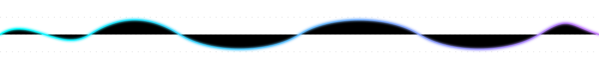
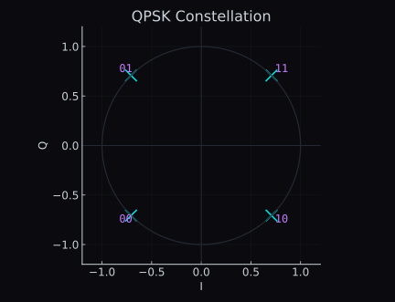
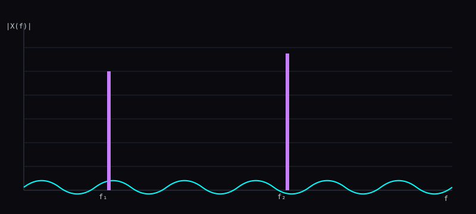

  

    
  

  <h1 style="color:#00FFFF;">Enrique / perazaharmonics</h1>
  <h3 style="color:#C77DFF;">RF • Digital Signal Processing • SDR • Real-time Systems • Kubernetes</h3>

  
<em>Building low-level systems that process and shape reality in real time.</em>

  

    
    
    
    
    
    
  

---

### About
- **DSP/RF engineer** building elegant **C++17 header-only** libraries and real-time DSP tools.
- Works on **telemetry ground systems** (AOS, commutators, packet processors) and **SDR** pipelines.
- Packages everything inside **containers**, orchestrated via **Kubernetes**, hardened for production.
- Enjoys proofs where they matter, profilers where they count, and **pretty waveforms always**.

---

### Current Work
- **FCWTransforms** — FFTs (Split-Radix, PFA, Bluestein, Rader), MUSIC, PCA, windowing zoo; Cosine Transforms.
- **Smart Wavelet Daughters (WOLA)** — live wavelet synthesis for timbre morphing.
- **Waveguide Modeling** — physical strings, bodies, FDN reverbs, 2D/3D meshes; fractional delays (Thiran→Farrow).
- **Aerospace SDR Stack** — VITA-49/DIFI transport, modular telemetry pipelines, HA/persistence.
- **K8s Infrastructure** — Cilium networking, Helm-managed services, persistent metrics endpoints.

---

### Visual Gallery — RF / DSP

  
  
  

  
  
  

---

### Selected Projects
- **[FCWTransforms](https://github.com/perazaharmonics/FCWTransforms)** — transforms toolkit: FFTs, DCTs, wavelets.
- **[Time Frequency Analysis](https://github.com/perazaharmonics/Time-and-Frequency-py)** — Multi Resolution Analysis.
- **[Digital Image Processing](https://github.com/perazaharmonics/Image-Processing-Matrices)** —
- **Peraza & Ampere Synth** — Wavelet atom injector, 4D waveshaping projection synth.
- **Aerospace SDR** — modular telemetry stack.

---

### Toolchain
- **Languages**: C++, C, Go, Python, MATLAB, LabVIEW, JAVA, BASH  
- **DSP**: FFTs, STFT/WOLA, Wavelets, MUSIC/ESPRIT, Kalman/LQG  
- **RF/SDR**: VITA-49, framing, constellations, SNR/EB/N₀, Ambiguity Surface Resolution, Phased Arrays  
- **Infrastructure**: Kubernetes, Helm, Cilium, containerd, Prometheus  
- **Build/Test**: CMake, Make, Catch2, GitHub Actions  
- **OS**: RHEL 8/9, Fedora, Alma

---

  

### Philosophy
> Build it. Break it. Learn from it.  
> Precision, noise, and punk

---

  
  

Built for RF, DSP, and clean systems.

