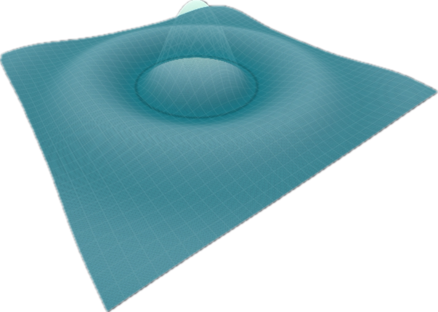

  

    
  

  <h1 style="color:#00FFFF;">Enrique / perazaharmonics</h1>
  <h3 style="color:#C77DFF;">RF • Digital Signal Processing • SDR • Real-time Systems • Software Development </h3>

  
<em>I just really like signals. Computers make waveforms go zoom. So I program those too.</em>

  

    
    
    
    
    
  

---

### About
- **DSP/RF engineer** building tools to process data with **nice shapes** on C++, mostly 
- Works on **telemetry ground systems** (AOS, commutators, packet processors) and **SDR** pipelines.
- Architects **Software Defined Radios** and optimizes them for **Real-Time** systems.
- Hardcore punk, man. Drumming, mathematical proofs, and **gorgeous signals**.
- **Software Systems Engineer** More Real-Time signal processing; less web development.
---

### Current Work
- **The Projectionist** - 4D Noise Field Projector onto a waveshapen LFO. Audio Scaping Engine.
- **EsPeranzaSDR** — VITA-49/DIFI transport, It's a secret. It's also a radio.
---
### Visual Gallery — RF / DSP

  <!-- Row1: EsPeranzaSDR Plots -->
  

    
    
  
 

---

### Selected Projects
- **[FCWTransforms](https://github.com/perazaharmonics/FCWTransforms)** — transforms toolkit: FFTs, DCTs, DWTs, MUSIC/ESPRIT Estimators; AF(w) Resolvers && Goertzel Tone Ranger (RADARs).
- **[Time Frequency Analysis](https://github.com/perazaharmonics/Time-and-Frequency-py)** — Multi Resolution Analysis.
- **[Digital Image Processing](https://github.com/perazaharmonics/Image-Processing-Matrices)** — 2D Spectral analysis kernels.
- **[SATMAT](https://github.com/perazaharmonics/SATMAT)** — Radio Frequency Ground Station and Satellite Calculations.

---

### Toolchain
- **Languages**: C++, C, Go, Python, Matlab, LabVIEW, Java, Bash, Assembly (Microcontrollers)
- **DSP**: FFTs, STFT/WOLA, Wavelets, MUSIC/ESPRIT, Pattern Recognition  
- **RF/SDR**: DIFI/VITA-49.2, DPDK, framing, constellations, SNR/EB/N₀, Ambiguity Surface Resolution, Phased Arrays  
- **Build/Test**: CMake, Make, Catch2, GitHub Actions  
- **OS**: RHEL 8/9, FedoraLinux, AlmaLinux, Ubuntu, Windows
---

  

### Philosophy
> Build it. Break it. Learn from it.  
> Precision, noise; punk rock.

---

  
  

Signals go brrr

